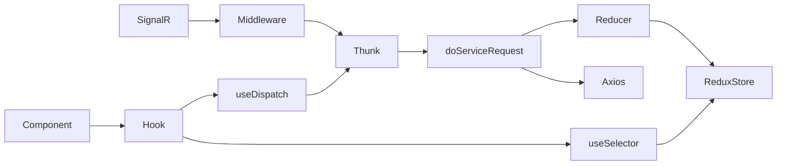
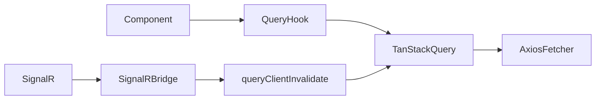

# Redux → TanStack Query Migration Plan

## Overview

This plan incrementally migrates the `client` app away from Redux toward TanStack Query (v5, already installed). The migration is structured in four phases, each delivering a working, testable state so contributors can review and understand changes before proceeding.

**Guiding principles:**
- The app stays shippable after every phase
- Redux and TanStack Query coexist during the transition via a **dual-dispatch bridge** in the SignalR middleware
- Each module is migrated fully (hook → component → SignalR → tests → Redux cleanup) before moving to the next
- New tests use `@testing-library/react` + MSW (mocked service worker) instead of testing reducers in isolation

---

## Current Architecture (per module)



## Target Architecture (per module)



---

## Phase 0: Shared Infrastructure

These pieces need to exist before any module migration begins.

### 0.1 — Query Key Factory

Create `client/src/lib/queryKeys.ts` — a centralized object of typed query key factories. This avoids scattered string arrays and enables precise `invalidateQueries` targeting.

```
// Example shape
export const queryKeys = {
  staffTeams:    (eventInstanceId: string) => ['staff', 'teams', eventInstanceId] as const,
  staffClues:    (eventInstanceId: string) => ['staff', 'clues', eventInstanceId] as const,
  staffGrid:     (eventInstanceId: string) => ['staff', 'grid', eventInstanceId] as const,
  // ... one entry per migrated module
};
```

### 0.2 — Typed Axios Fetcher

Create `client/src/lib/apiFetch.ts` — a thin wrapper around Axios that handles the 401/403 error behaviour currently in `doServiceRequest`, returning a clean typed promise for TanStack Query's `queryFn`.

### 0.3 — Expose queryClient Singleton

In `client/src/index.tsx`, move `queryClient` creation to a separate `client/src/lib/queryClient.ts` module so it can be imported by non-React code (specifically the SignalR middleware).

```ts
// client/src/lib/queryClient.ts
import { QueryClient } from '@tanstack/react-query';
export const queryClient = new QueryClient({ ... });
```

Then import it back into `index.tsx` instead of constructing it inline.

### 0.4 — Dual-Dispatch SignalR Bridge

Update `client/src/modules/signalr/middleware.ts` to import `queryClient` from `lib/queryClient.ts`. For each SignalR callback that corresponds to a migrated module, add a `queryClient.invalidateQueries(...)` call **alongside** (not replacing) the existing Redux dispatch. Redux dispatches for unmigrated modules are left untouched.

```ts
// Example: after teams is migrated
.add('admin_submission', (teamId) => (dispatch, getState) => {
    // Redux path (kept until all consumers of these modules are migrated)
    dispatch(fetchStaffTeams());
    dispatch(getStaffGrid());
    // TanStack path (added now)
    const eventInstanceId = getEventInstanceId(getState());
    queryClient.invalidateQueries({ queryKey: queryKeys.staffTeams(eventInstanceId) });
})
```

---

## Phase 1: staff/teams (Pilot Migration)

This module is the pilot because it is already open, has the most complete test coverage, and touches both read and write operations.

### Step-by-step

#### 1.1 — Write new TanStack Query hooks

Create `client/src/modules/staff/teams/queries.ts` alongside the existing files. **Do not delete anything yet.**

Hooks to create:
- `useStaffTeamsQuery()` — `useQuery` wrapping `GET /api/staff/teams/:eventInstanceId`
- `useAddOrUpdateTeamMutation()` — `useMutation` wrapping `PUT /api/staff/teams/:eventInstanceId`
- `useDeleteTeamMutation()` — `useMutation` wrapping `DELETE .../teams/:teamId`
- `useUpdateCallMutation()` — `useMutation` wrapping `PUT .../teams/:teamId/call`
- `useUpdatePointsMutation()` — `useMutation` wrapping `PUT .../teams/:teamId/points`
- `useUpdateTeamDataMutation()` — `useMutation` wrapping `PUT .../teams/:teamId/data`

Each mutation's `onSuccess` calls `queryClient.invalidateQueries({ queryKey: queryKeys.staffTeams(...) })`.

#### 1.2 — Replace hook consumption in components

Update the following components to use the new query hooks instead of `useStaffTeams`:
- `client/src/components/staff/StaffTeams.tsx`
- `client/src/components/staff/StaffTeamDetails.tsx`
- `client/src/components/staff/teamDetails/` (all sub-components)
- Any dialog forms that call team mutations

The existing `useStaffTeams` export in `modules/staff/teams/hooks.ts` is **left in place** until all consumers are updated.

#### 1.3 — Update SignalR bridge

Add `queryClient.invalidateQueries` calls to the `admin_submission` and `admin_call` SignalR callbacks for the `staffTeams` query key (per Phase 0.4 pattern above).

#### 1.4 — Write new integration tests

Create `client/src/modules/staff/teams/staffTeams.query.test.ts`.

Test pattern:
- Use `renderHook` from `@testing-library/react` with a `QueryClientProvider` wrapper
- Mock the network layer with `msw` (install if not present) or `jest.spyOn(axios, 'get')`
- Test: teams are fetched on mount, mutations invalidate the cache, error state is surfaced

The existing `staffTeamsModule.test.ts` reducer tests are kept — reducers still exist and the tests still pass during this phase.

#### 1.5 — Delete Redux artifacts for teams

Only once components and tests pass:
- Delete `client/src/modules/staff/teams/actions.ts`
- Delete `client/src/modules/staff/teams/staffTeamsModule.ts`
- Delete `client/src/modules/staff/teams/selectors.ts`
- Delete `client/src/modules/staff/teams/hooks.ts` (old Redux hook)
- Delete `client/src/modules/staff/teams/staffTeamsModule.test.ts`
- Remove `staffTeamsReducer` from `client/src/modules/staff/index.ts` `combineReducers`
- Remove `staff.teams` slice from the Redux store shape

---

## Phase 2: Remaining Staff Modules

Repeat the Phase 1 pattern for each of the following modules, in this recommended order (simpler → more complex):

| Order | Module | Status | Notes |
|-------|--------|--------|-------|
| 2.1 | `staff/feed` | ✅ Done | Read-only, no mutations. Good confidence builder. |
| 2.2 | `staff/grid` | ✅ Done | Read + `getStaffGrid` refresh. Heavily SignalR-triggered. See notes below. |
| 2.3 | `staff/achievements` | | Two hooks (`useStaffAchievements`, `useAchievementUnlocks`). Parameterized by `teamId`. |
| 2.4 | `staff/challenges` | ✅ Done | Two hooks, one parameterized by `challengeId`. See detailed breakdown below. |
| 2.5 | `staff/clues` | | Complex: `staffCluesModule` is registered at root, not under `staff`. Requires care. |
| 2.6 | `staff/messages` | ✅ Done | Review `messagesModule.ts` for any cross-module dependencies. |

### 2.2 — staff/grid (Migration Notes)

**Completed:** TanStack Query hook + component migration + SignalR bridge + integration tests.

**Key observations:**

1. **Two separate consumers with different polling needs:**
   - `StaffGrid.tsx` uses a simple 30s polling interval via `useStaffGridQuery({ refetchInterval: 30000 })`
   - `StaffActionCenter.tsx` uses `gridDataHooks.ts` which wraps `useStaffGridQuery` with derived/memoized data (ExtendedGridTeam, ExtendedGridClue) and supports a 5s "fast refresh" mode

2. **`gridDataHooks.ts` (`actions/staff/gridDataHooks.ts`) was migrated in-place** rather than deleted, because `StaffActionCenter` depends on the derived `ExtendedGridTeam`/`ExtendedGridCellData`/`ExtendedGridClue` types and memoized computations. It now imports from `useStaffGridQuery` instead of using `useSelector`/`useDispatch`.

3. **No mutations exist** — the grid is purely read-only. All data changes arrive either via polling (`refetchInterval`) or SignalR invalidation (`admin_submission`, `admin_call` callbacks).

4. **SignalR dual-dispatch:** Both `admin_submission` and `admin_call` now invalidate `queryKeys.staff.grid(eventInstanceId)` alongside the existing Redux `dispatch(getStaffGrid())`. The Redux dispatch is kept until all consumers are fully migrated.

5. **Redux artifacts fully deleted:** `staffGridModule.ts`, `service.ts`, `actions.ts`, `selectors.ts`, `hooks.ts` are all removed. The `gridReducer` was removed from `combineReducers` in `modules/staff/index.ts`, and the `staff` slice (which only contained `grid`) was removed from the root reducer in `modules/index.ts`. The `dispatch(getStaffGrid())` calls in the SignalR middleware were also removed — only TanStack invalidation remains.

6. **`useMemo` dependencies fixed:** The old `gridDataHooks.ts` had `[gridModule, hidePlot]` and `[gridModule]` as memo dependencies (entire Redux module reference). Updated to `[teams, clues, hidePlot]` and `[clues]` for more precise memoization.

### 2.4 — staff/challenges (Detailed Breakdown)

**Current state:** Two Redux hooks (`useStaffChallenges`, `useStaffChallengeDetails`), one reducer (`challengesReducer`), four service thunks. The reducer handles `USER_LOGGED_OUT` to reset state.

#### 2.4.1 — Write `queries.ts` with TanStack Query hooks

Create `client/src/modules/staff/challenges/queries.ts`. The reducer stores `payload` directly in the `FETCHED` case (`data: payload`), so the API returns a plain `Challenge[]` — no `select` unwrap needed.

Hooks to create:

- **`useStaffChallengesQuery()`** — `useQuery` wrapping `GET /api/staff/challenges/:eventInstanceId`
  - Returns the full challenge list including nested `submissions` arrays
  - Used by `Challenges.tsx` and `TeamChallenges.tsx`

- **`useStaffChallengeDetailsQuery(challengeId)`** — Derives a single challenge from `useStaffChallengesQuery()` via `select`
  - Pattern: `select: (challenges) => challenges.find(c => c.challengeId === challengeId)`
  - This avoids a separate API call — the existing Redux hooks both call the same `getChallenges()` thunk
  - Used by `StaffChallengeDetails.tsx`

- **`useAddOrUpdateChallengeMutation()`** — `useMutation` wrapping `PUT /api/staff/challenges/:eventInstanceId`
  - Request body: `ChallengeTemplate`
  - On success: invalidate `queryKeys.staff.challenges(eventInstanceId)`
  - Used by `Challenges.tsx` (add) and `StaffChallengeDetails.tsx` (edit)

- **`useUpdateChallengeSubmissionMutation(challengeId)`** — `useMutation` wrapping `PUT /api/staff/challenges/:eventInstanceId/:challengeId`
  - Request body: `ChallengeApproval`
  - On success: invalidate `queryKeys.staff.challenges(eventInstanceId)`
  - Used by `StaffChallengeDetails.tsx` (approve/reject submissions)

- **`useDeleteChallengeMutation()`** — `useMutation` wrapping `DELETE /api/staff/challenges/:eventInstanceId/:challengeId`
  - On success: invalidate `queryKeys.staff.challenges(eventInstanceId)`
  - Note: Not currently used by any component, but the service thunk exists. Include for completeness or omit — decide at implementation time.

#### 2.4.2 — Update consuming components

Three components consume the Redux hooks:

| Component | Current hook | New hook(s) |
|-----------|-------------|-------------|
| `components/staff/challenges/Challenges.tsx` | `useStaffChallenges()` → `challengesModule`, `addChallenge` | `useStaffChallengesQuery()` → `{ data, isLoading, error }` + `useAddOrUpdateChallengeMutation()` |
| `components/staff/StaffChallengeDetails.tsx` | `useStaffChallengeDetails(id)` → `challenge`, `updateApproval`, `updateChallenge` | `useStaffChallengeDetailsQuery(id)` + `useAddOrUpdateChallengeMutation()` + `useUpdateChallengeSubmissionMutation(id)` |
| `components/staff/teamDetails/TeamChallenges.tsx` | `useStaffChallenges()` → `challengesModule` | `useStaffChallengesQuery()` → `{ data, isLoading }` |

**`Challenges.tsx` changes:**
- Replace `challengesModule.lastError` with `error` from `useStaffChallengesQuery()`
- Replace `challengesModule.isLoading` with `isLoading`
- Replace `challengesModule.data` with `data ?? []`
- The `ChallengesList` sub-component currently receives `challengesModule: Module<Challenge[]>`. Update its `Props` type to accept the plain data/loading/error props instead of the `Module` wrapper.

**`StaffChallengeDetails.tsx` changes:**
- Replace `useStaffChallengeDetails(id)` with the three individual hooks
- `challenge` comes from `useStaffChallengeDetailsQuery(id).data`
- `updateChallenge` comes from `useAddOrUpdateChallengeMutation().mutate`
- `updateApproval` comes from `useUpdateChallengeSubmissionMutation(id).mutate`

**`TeamChallenges.tsx` changes:**
- Replace `challengesModule` with `{ data, isLoading }` from `useStaffChallengesQuery()`
- Minimal changes — component only reads `isLoading` and `data`

**Dialog forms (`ChallengeForm.tsx`, `ChallengeApprovalForm.tsx`):**
- No changes needed — these receive callbacks via props (`onSubmit`) and don't import Redux directly

#### 2.4.3 — Update SignalR bridge

The `admin_challenge` callback in `middleware.ts` currently dispatches `getChallenges()`. Add a TanStack invalidation alongside:

```ts
.add('admin_challenge', (teamId: string) => (dispatch: any, getState: () => any) => {
    dispatch(getChallenges());
    // TanStack path
    const eventInstanceId = getEventInstanceId(getState());
    queryClient.invalidateQueries({ queryKey: queryKeys.staff.challenges(eventInstanceId) });
})
```

#### 2.4.4 — Write integration tests

Create `client/src/modules/staff/challenges/staffChallenges.query.test.tsx`.

Test cases:
- `useStaffChallengesQuery` fetches challenges on mount and returns data
- `useStaffChallengeDetailsQuery` returns the correct challenge by `challengeId`
- `useAddOrUpdateChallengeMutation` invalidates the challenges cache on success
- `useUpdateChallengeSubmissionMutation` invalidates the challenges cache on success
- Error states are surfaced via `error`

#### 2.4.5 — Delete Redux artifacts

Once components and tests pass:
- Delete `client/src/modules/staff/challenges/actions.ts`
- Delete `client/src/modules/staff/challenges/reducer.ts`
- Delete `client/src/modules/staff/challenges/service.ts`
- Delete `client/src/modules/staff/challenges/hooks.ts`
- Update `client/src/modules/staff/challenges/index.ts` to export from `queries.ts` and `models.ts` only
- Remove `challengesReducer` from `client/src/modules/staff/index.ts` `combineReducers`
- Remove the `export * from './challenges/hooks'` re-export from `client/src/modules/staff/index.ts`
- Remove the `getChallenges` import from `middleware.ts` and the Redux dispatch from `admin_challenge` callback (keep only the TanStack invalidation)

---

For each module, the steps are identical to Phase 1:
1. Write `queries.ts` with `useQuery` / `useMutation` hooks
2. Update consuming components
3. Update SignalR bridge callbacks
4. Write new integration tests
5. Delete Redux artifacts and remove from `combineReducers`

---

## Phase 3: Player & Admin Modules

After all staff modules are migrated, apply the same pattern to:

**Player modules** (in `client/src/modules/player/`):
- `player/clues`
- `player/calls`
- `player/challenges`
- `player/messages`
- `player/achievements`

**Admin modules** (in `client/src/modules/admin/`):
- `admin/users`
- `admin/settings`

These are likely simpler than staff modules (fewer mutations, less SignalR interaction), so Phase 3 should go faster.

---

## Phase 4: Final Cleanup

### 4.1 — Auth / User module evaluation

The `user` reducer handles login state and the `USER_LOGGED_OUT` action, which several other reducers currently react to (e.g., `feedReducer`). Options:

- **Keep in Redux**: If user/auth is the last Redux slice, a minimal Redux store containing only user state is acceptable long-term
- **Move to React Context**: Replace `userReducer` with a `UserContext` provider initialized from `localStorage`
- **Decision point**: Defer this decision until Phases 2–3 are done and the actual dependency surface is clear

### 4.2 — Remove Redux packages

Once all modules (except potentially `user`) are migrated, remove from `package.json`:
- `redux`
- `react-redux`
- `redux-thunk`
- `redux-auth-wrapper`
- `react-router-redux`
- `redux-signalr`
- `@types/react-redux`
- `@types/react-router-redux`
- `@types/redux-auth-wrapper`

### 4.3 — Replace SignalR dual-dispatch bridge

Update `client/src/modules/signalr/middleware.ts` to remove all Redux `dispatch` calls, replacing them with pure `queryClient.invalidateQueries(...)`. The middleware no longer needs to be a Redux middleware — it can become a plain React hook or module initialized in `App.tsx`.

---

## File Map: What Changes Where

```
client/src/
├── lib/                          ← NEW
│   ├── queryClient.ts            ← NEW: singleton QueryClient
│   ├── queryKeys.ts              ← NEW: typed key factory
│   └── apiFetch.ts               ← NEW: typed axios wrapper
├── index.tsx                     ← MODIFY: import queryClient from lib/
├── modules/
│   ├── signalr/middleware.ts      ← MODIFY: dual-dispatch bridge → pure invalidation
│   ├── staff/
│   │   ├── index.ts              ← MODIFY: remove reducer registrations as modules migrate
│   │   └── teams/
│   │       ├── queries.ts        ← NEW: TanStack Query hooks
│   │       ├── models.ts         ← KEEP: types are still needed
│   │       ├── service.ts        ← DELETE (after migration)
│   │       ├── actions.ts        ← DELETE (after migration)
│   │       ├── staffTeamsModule.ts ← DELETE (after migration)
│   │       ├── selectors.ts      ← DELETE (after migration)
│   │       └── hooks.ts          ← DELETE (after migration)
```

---

## Testing Strategy

| Phase | Test type | Tool | What's tested |
|-------|-----------|------|---------------|
| 0 | Unit | Jest | `queryKeys` factory returns correct arrays |
| 1–3 | Integration | RTL + axios mock / MSW | Hook fetches data, mutations invalidate cache, error states |
| 1–3 | Component | RTL | Component renders loading/data/error states correctly |
| Throughout | Regression | Existing Jest reducer tests | Run until Redux artifacts are deleted to confirm no regressions |

---

## Risks & Mitigations

| Risk | Mitigation |
|------|-----------|
| SignalR real-time invalidation gaps during transition | Dual-dispatch bridge ensures both Redux and TanStack Query are notified |
| `staffClues` is registered at root reducer, not under `staff` | Treat it as a separate migration step; its key in the Redux store differs from other staff modules |
| `USER_LOGGED_OUT` action resets some reducers | Identify all reducers that listen to this action before deleting them; handle cleanup in TanStack Query via `queryClient.clear()` on logout |
| `eventInstanceId` is read from Redux state inside service thunks | New `queries.ts` hooks will read `eventInstanceId` via a `useSelector` or a dedicated `useEventInstanceId` hook during the transition, then from user context after auth is migrated |
| API response envelope: some endpoints return `{ items: T[] }` rather than a plain `T[]` | Before writing `queryFn`, check the reducer's `FETCHED` case: if it does `data: payload.items`, the API wraps in `{ items: [...] }` and `queryFn` must be typed accordingly. Use `select: (r) => r.items` to unwrap so `.data` in the component is the plain array. If the reducer does `data: payload` directly, the API returns a plain array and no `select` is needed. |
